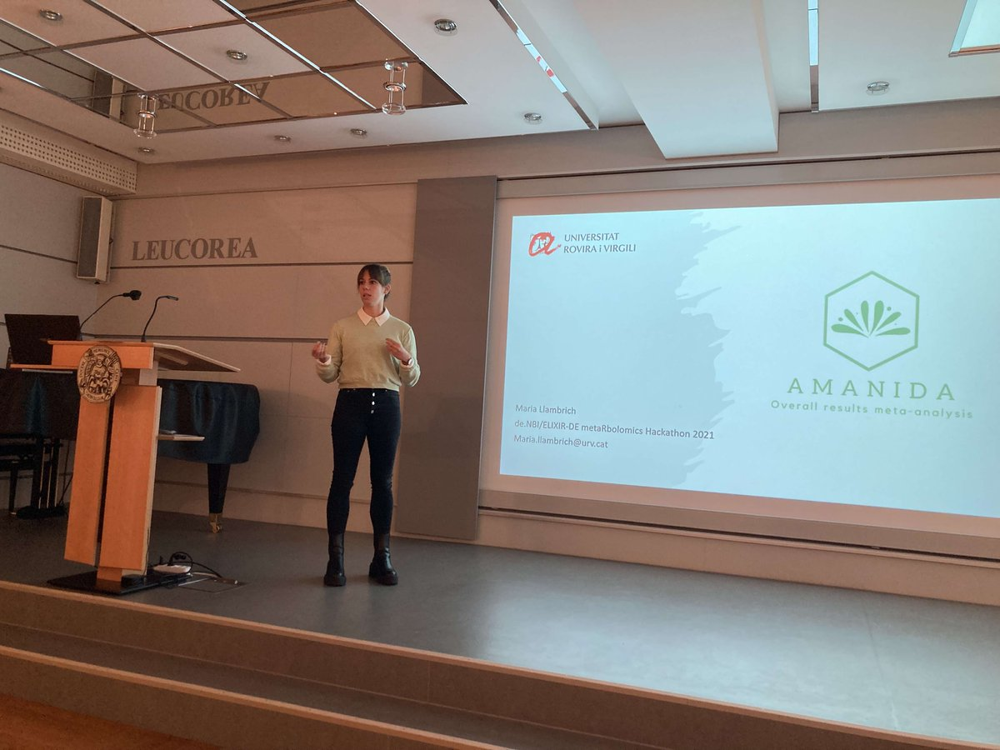
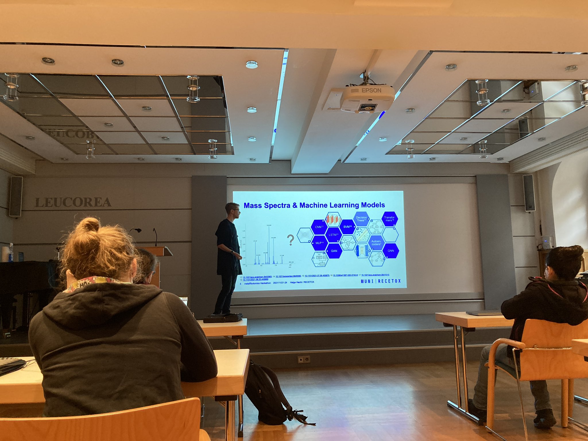
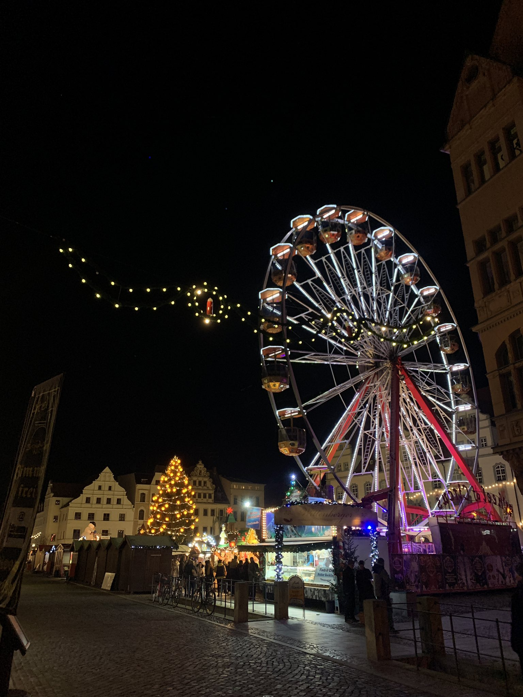

```{r setup, include=FALSE}
knitr::opts_chunk$set(echo = FALSE)

# Learn more about creating blogs with Distill at:
# https://rstudio.github.io/distill/blog.html

```

The 3rd metaRbolomics hackathon was organized by Steffen Neumann (@sneumann) to
bring developers and users of mass spectrometry and metabolomics-related R
packages together to improve interoperability between packages, identify gaps
and needs in current functionality and to foster collaboration between
developers. The event took place from the 22-24 of November, with funding from
the [de.NBI ELIXIR-DE](https://www.denbi.de/) in Wittenberg (Germany) as an
in-person event. As a safety measure, participants had the opportunity for
on-site fast COVID-19 self-tests and all participants wore masks during the
whole event.

Participants were also allowed to give flash talks presenting either R packages
or approaches and concepts such as [Maria
Llambrich](https://github.com/mariallr) presenting the
[`amanida`](https://cran.r-project.org/web/packages/amanida/index.html) R package
for meta-analysis of metabolomics studies or [Helge
Hecht](https://github.com/hechth) giving an overview of machine learning
approaches for annotation of small compounds in mass spectrometry data.





After the actual hacking session participants socialized for example on the
Christmas Market in Wittenberg.



Among projects and collaborations that were started at the hackathon were a new `MsBackend`
for the [`Spectra`](https://doi.org/doi:10.18129/B9.bioc.Spectra) Bioconductor
package allowing handling of TimsTOF data
([`MsBackendTimsTOF`](https://github.com/rformassspectrometry/MsBackendTimsTof/)),
updates and fixes for the [`MsQuality`](https://github.com/tnaake/MsQuality/)
package as well as further development and expansion of the
[`xcmsViewer`](https://github.com/mengchen18/xcmsViewer).

Summarizing, the hackathon was a very nice event fostering open science and
open development in the metabolomics community.


