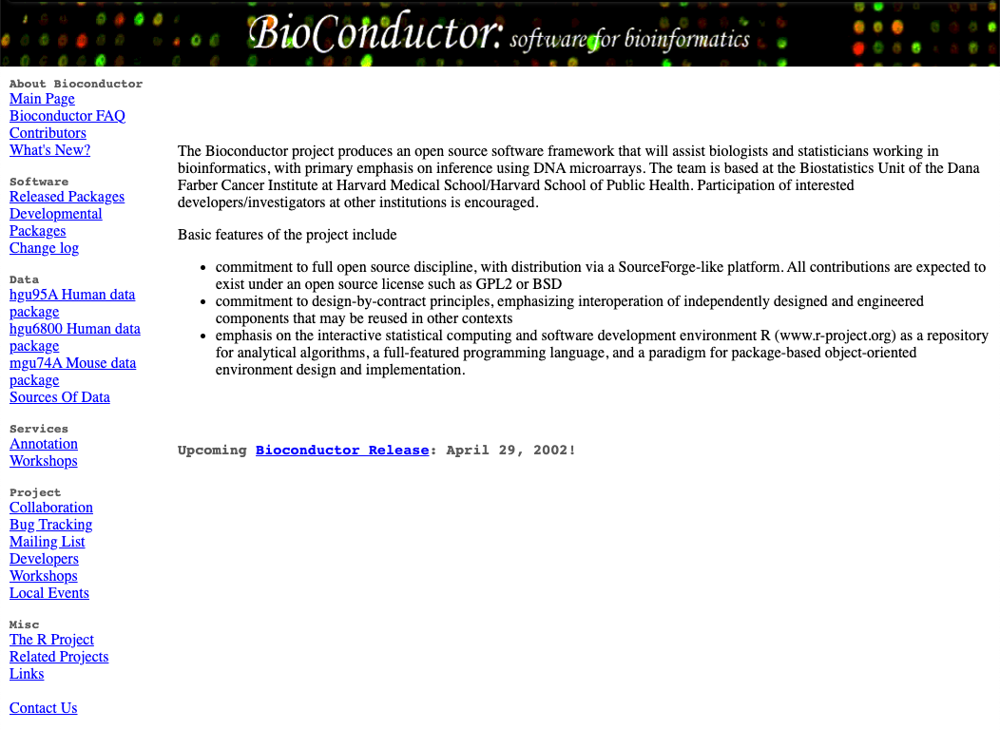

```{r setup, include=FALSE}
knitr::opts_chunk$set(echo = FALSE)

# Learn more about creating blogs with Distill at:
# https://rstudio.github.io/distill/blog.html

```

```{r bib, include=FALSE}
options(htmltools.dir.version = FALSE)
library(RefManageR)
library(bibtex)
bib <- ReadBib("../bibliography.bib")
BibOptions(
  longnamesfirst = FALSE,
  check.entries = FALSE,
  bib.style = "authoryear",
  cite.style = "authoryear",
  max.names = 1,
  style = "html",
  hyperlink = "to.bib",
  dashed = TRUE)
```

What a perspective!
Twenty years of continuous contributions to fields ranging from biomedical data sciences
to immunology, microbiology and most recently single-cell genomics.

Writing this as an early career postdoctoral researcher who started using Bioconductor packages as a graduate student about 10 years ago (just about half the lifetime of the Bioconductor project at this point), I feel privileged to reflect on the most recent half of the Bioconductor project lifetime that I have had the chance to witness first-hand, both as a user and a contributor.

I will skip over the first 10 years years, and redirect the nostalgic ones to the Wayback Machine snapshot of [the Bioconductor website in March 2002][bioc-website-2002] and the first published article describing the aims and methods of the project at its inception `r Citet(bib, "Gentleman2004")`



OK, well, taking a brief look at the Wayback machine snapshot, let's just take a second to acknowledge that at its inception (Bioconductor Release 1.0: May 2, 2002), the Bioconductor project included just 15 packages, broadly classified as:

- annotation
- data management and organization
- differential expression
- analysis of microarray data
- visualisation and normalisation of microarray data
- storage and retrieval of large datasets

To put that into perspective, the Bioconductor project is now (Bioconductor 3.14; October 27, 2021) strong of:

- 2083 software packages
- 408 experiment data packages
- 904 annotation packages
- 29 workflows
- 8 books

That is about 1 new package every other day for the past twenty years. Way to go!


That collection of core-maintained and community-contributed packages has grown so large that there is now an entire hierarchy of terms to categorise those packages, called [BiocViews][biocviews-website].
Check them out!

But the Bioconductor project has grown to become so much more than a collection of software packages for bioinformatics.
The success of the Bioconductor project has also grown a welcoming and inclusive community made of a [Core Team][bioc-core-team], package developers, and users of all backgrounds and experience levels.
I am reminded daily of this friendly, active, and stimulating environment through the [Slack workspace][bioc-slack], the [Support site][bioc-support-website], and the [YouTube channel][bioc-youtube].
On top of that, regular events that bring the community together are the highlight of my calendar: the annual BioC conference in North America, the regional meetings in Europe ([EuroBioC][eurobioc-website]), Asia ([BioC Asia][biocasia-website]), and summer schools (e.g., [CSAMA][csama-website]).

And speaking of conference, let me close on the celebrations of the 20th anniversary of the Bioconductor project, as a [collection of photos contributed by community members][slides-20years] presented during the BioC 2021 conference [Meet the Community Advisory Board (CAB) session][bioc2021-20years].
I'm sure this will bring up memories for some of the earliest contributors to the Bioconductor project, and I hope that it will show even the most recent users how open and welcoming the Bioconductor community is!


# References

```{r, results='asis', echo=FALSE}
PrintBibliography(bib)
```

[bioc-website-2002]: http://web.archive.org/web/20020327093500/https://bioconductor.org/
[biocviews-website]: https://www.bioconductor.org/packages/release/BiocViews.html
[bioc-core-team]: https://www.bioconductor.org/about/core-team/
[bioc-slack]: https://bioc-community.herokuapp.com/
[bioc-support-website]: https://support.bioconductor.org/
[bioc-youtube]: https://www.youtube.com/user/bioconductor
[eurobioc-website]: http://eurobioc2019.bioconductor.org/
[biocasia-website]: https://bioconductor.github.io/BiocAsia/
[csama-website]: https://www.huber.embl.de/csama2019/
[slides-20years]: https://kevinrue.github.io/Bioconductor20YearsSlides/
[bioc2021-20years]: https://youtu.be/LTT1i_ACpxc?t=1059