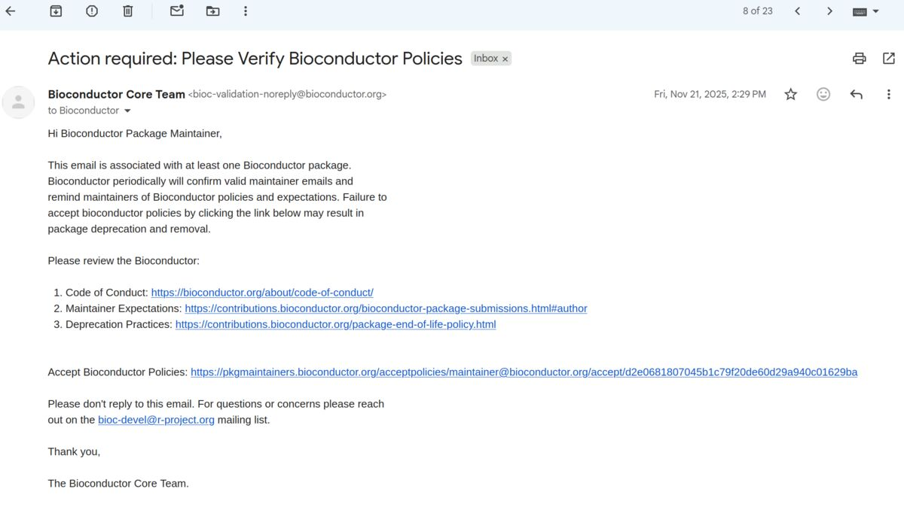
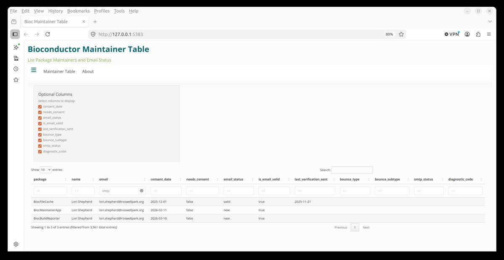

## Introduction

Bioconductor policies include being an active and reachable
maintainer. Maintainer emails in the DESCRIPTION of packages often go stale as
maintainers change positions. There is also a necessity to have maintainers opt
into Bioconductor policies and procedures as they change over time.

We have created an application that uses Amazon Simple Email Service (SES) to send periodic
emails to maintainers to check if the endpoint is reachable and to send a
verification opt-in of Bioconductor current policies and procedures and code of
conduct once a year.

{fig-alt="Photo of Email" fig-align="center"}

Initial feedback is that this email is "spammy" and may be marked as such by
institutions, but it is an initial attempt at compliance.  We will look at
alternatives to emails like specialized maintainer account access at a future
date.

#### Access to Information

The information is in a publicly accessible database. We do not recommend
connecting directly to the webservice but instead using the accompanied
Bioconductor R package
[BiocMaintainerApp](https://bioconductor.org/packages/BiocMaintainerApp/). It
provides a Shiny application interface for querying Bioconductor package maintainers'
information.

{fig-alt="Photo of ShinyApp" fig-align="center"}

#### Thank you

We appreciate maintainers' cooperation moving forward.