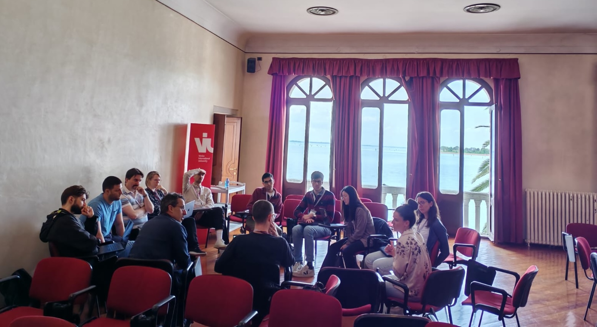

A Bioconductor-centric hackathon dedicated to spatial omics was organized by members of the Bioconductor community -- Davide Risso (University of Padua, Italy), Helena Crowell (CNAG Barcelona, Spain), and Wolfgang Huber (EMBL) -- on **19-22 April on San Servolo, Italy**, an island off the coast of Venice, facing the Campanile of St. Mark's Square. 

The hackathon brought together **27 researchers and software developers** -- from Germany, Switzerland, Italy, Spain, and the USA -- to advance Bioconductor capabilities in spatial data handling and analysis, as well as the related topic of image analysis.

Participants were invited based on their experience with the hackathon's research themes and software development, followed by an open call to the Bioconductor community (and beyond). 
The final group of participants included a mix of early-career and senior researchers, including two [scverse](https://scverse.org/) members and one industry researcher, with a range of expertise in spatial omics, image analysis, and software development.

![Picture time on a terrace overlooking St. Mark's Square from San Servolo island. (Back:) Elisabeth Purdom, Wolfgang Huber, Pere Moles Serò, Rafael Irizarry, Helena Crowell, Martin Emons, Dario Righelli, Juan Henao, Sean Davis, Gabriele Sales, Mike Smith, Ilaria Billato, Patrick Danaher, Hugo Gruson, Carissa Chen, Daria Lazic, Luca Marconato, Artür Manukyan. (Front:) Davide Risso, Sviatoslav Kharuk, Michael Stadler, Samuel Gunz, Robert Castelo, Charlotte Soneson, Matteo Calgaro, Gabriel Grajeda, Riccardo Ceccaroni.](terrace.jpeg)

The hackathon centered on spatial omics and other bioimaging data, with emphasis on data representation, interoperable serialization, scalable data handling, Python interoperability, interactive visualization. The hackathon ran over three days with the majority of the time spent in teams who independently developed and implemented a plan that addressed a challenge or met a goal important to team members.

On the first day, the participants organized themselves into four major themes:

- **Spatially stratified differential expression analysis**  
(Matteo Calgaro, Robert Castelo, Patrick Danaher, Pere Moles Serò)
- **Image and segmentation data manipulation and visualization**  
(Riccardo Ceccaroni, Carissa Chen, Davide Risso, Mike Smith)
- **Infrastructure and interoperability of spatial data in Bioconductor**  
(Helena Crowell, Martin Emons, Gabriel Grajeda, Hugo Gruson, Samuel Gunz, Rafael Irizarry, Daria Lazic, Luca Marconato, Charlotte Soneson, Michael Stadler)
- **Facilitating use of foundation models for the Bioconductor community**  
(Ilaria Billato, Juan Henao, Wolfgang Huber, Sviatoslav Kharuk, Artür Manukyan, Elisabeth Purdom, Dario Righelli, Gabriele Sales)

Each day started with a brief session in which each team set up goals for the day. Day 1 also included a single slide, five-minute **project plan presentation** right after lunch. This presentation mid-day served to help teams develop a focused project quickly, with the understanding that the project plan would likely change over the next 2 days. 

Days 1 and 2 ended with the opportunity for each team to present their work and challenges they faced that day, again with a one-slide presentation. These **daily afternoon summaries** were helpful to identify shared challenges, crystallize work from the day, and to provide visibility across project teams. 

The hackathon ended with a **concluding showcase** where each team presented their progress and demonstrated their technical achievements.
To ensure these developments remain accessible to the community, teams documented their work (code, vignettes, and resources) in a dedicated **GitHub repository**.
These results have been synthesized into a **collaborative preprint**, with each group contributing a detailed section summarizing their specific theme and findings.

- [GitHub repository](https://github.com/BiocCodingCollaborations/VeniceHackathon2026) housing code and resources developed during the hackathon.
- [Collaborative preprint](https://doi.org/10.37044/osf.io/9ej32_v1) summarizing the format, themes, and outputs of the hackathon.

***

The event was organized by the Department of Statistical Sciences of the University of Padova in collaboration with EMBL and Venice International University, funded in part by the European Research Council (ERC) Grant CoG 101171662, and supported by EMBL's Transversal Theme Theory\@EMBL.

***
