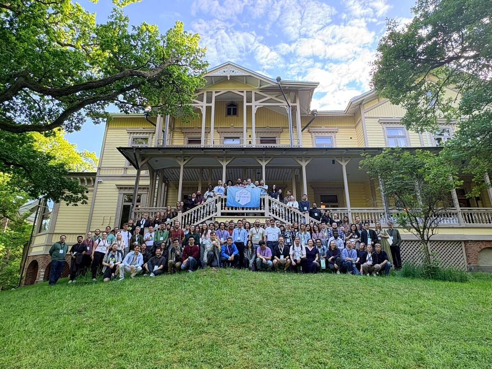
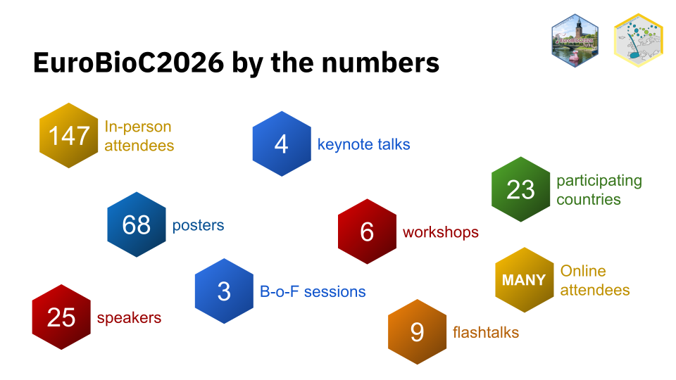
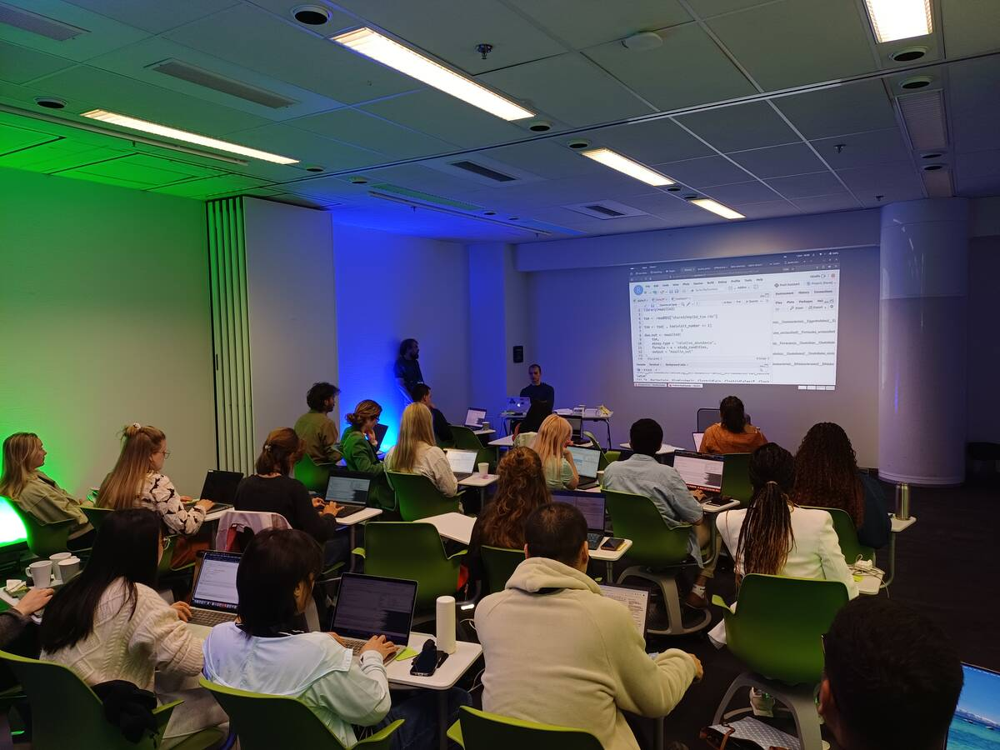
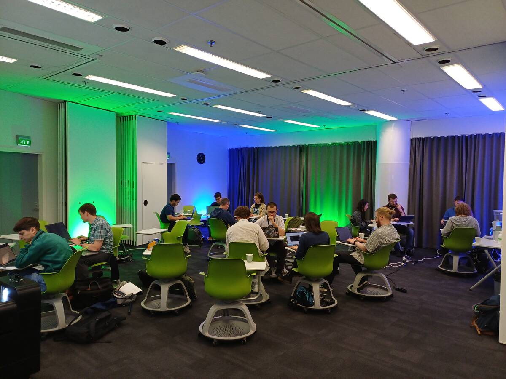
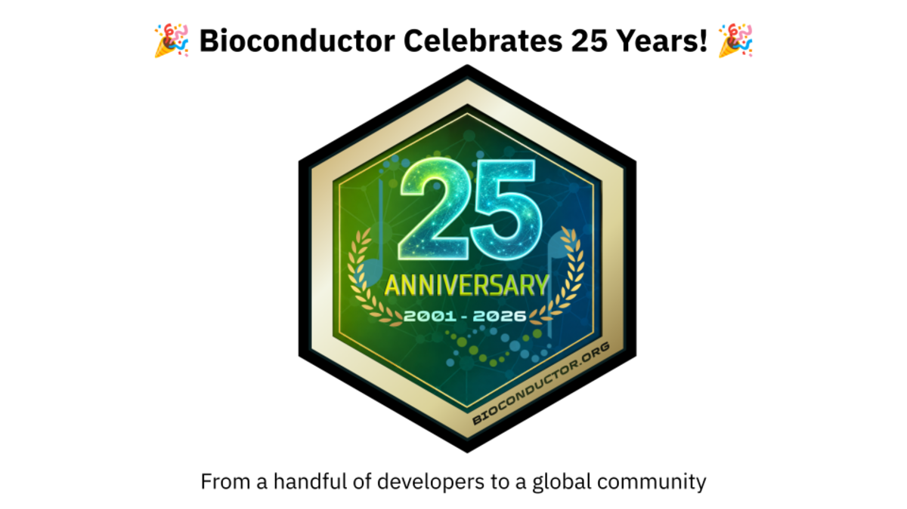
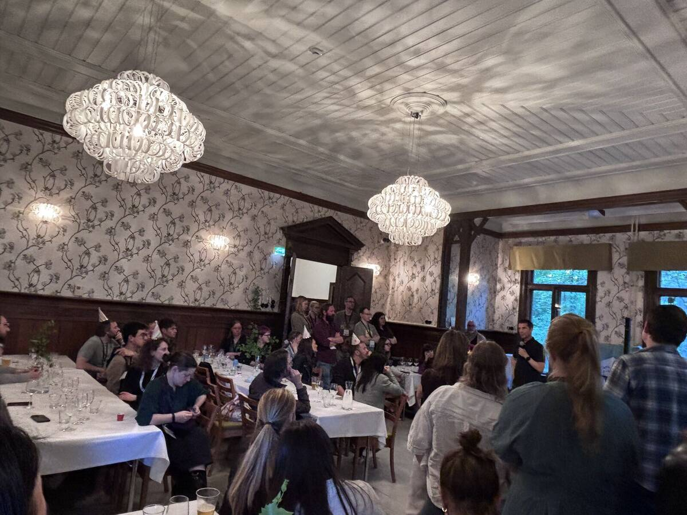
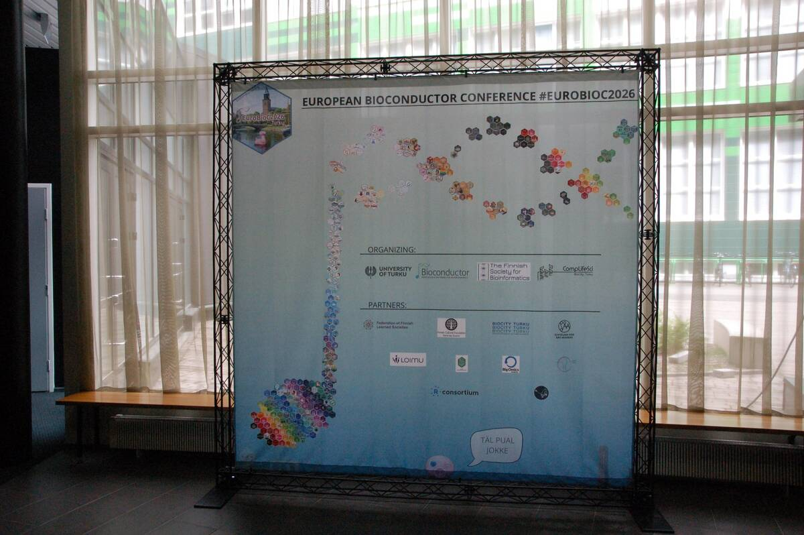
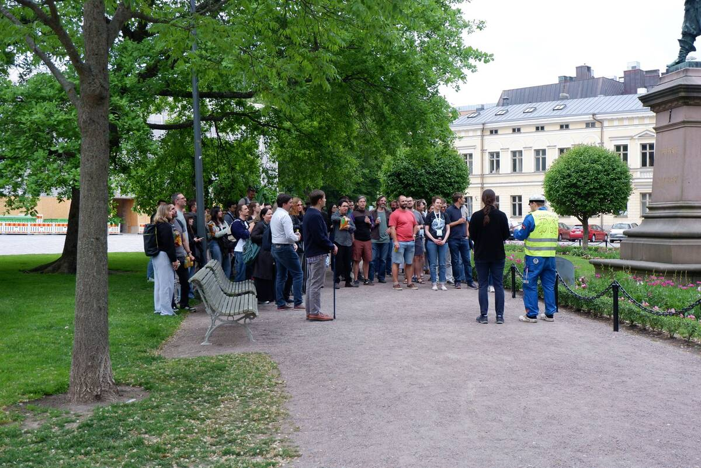
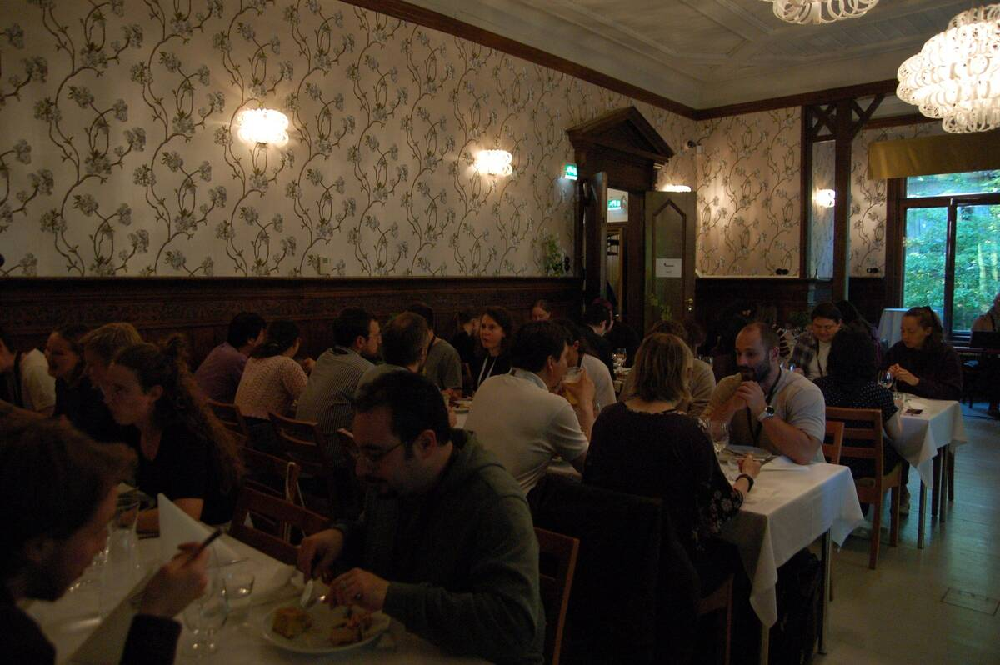
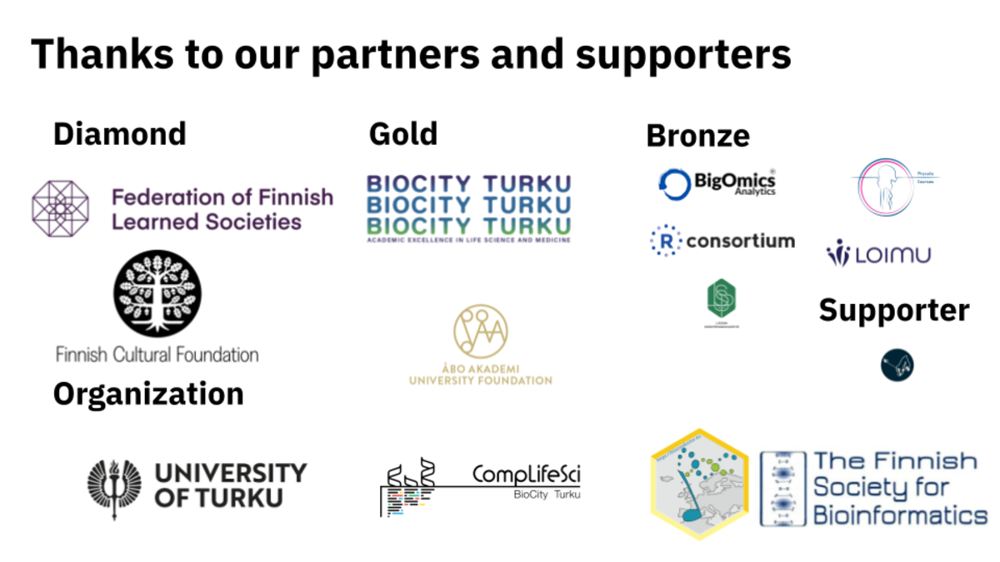

{.zoomable width="100%"}

The European Bioconductor Conference 2026 ([EuroBioC2026](https://eurobioc2026.bioconductor.org/)) took place from June 3-5, 2026, in Turku, Finland. Hosted by the ([University of Turku](https://www.utu.fi/en)) and the ([Finnish Society for Bioinformatics](https://www.bioinf.fi/)) at BioCity, the conference brought together the Bioconductor community to showcase the latest developments in Bioconductor software packages and discuss emerging technologies shaping computational biology.
This year's conference welcomed 147 in-person participants from 23 countries. Across three days, attendees participated in keynote lectures, short and flash talks, workshops, poster sessions, Birds-of-a-Feather discussions, and community events. The conference also marked an important milestone for the project as Bioconductor celebrated its 25th anniversary.
The figures below summarise EuroBioC2026 at a glance: 147 attendees from 23 countries, 4 keynote speakers, 25 speakers, 68 posters, 6 workshops, 9 flash talks, and 3 Birds-of-a-Feather sessions.

{.zoomable width="100%"}

## Participants by country
Participants travelled to Turku from across Europe and beyond, reflecting the increasingly global nature of the Bioconductor community. While Finland represented the largest delegation, attendees also joined from Italy, Belgium, Germany, Switzerland, the United States, Sweden, the United Kingdom, Ireland, Spain, Kenya, South Korea, Australia, and several other countries.

## Preconference
Ahead of the main conference, EuroBioC2026 hosted two preconference events on June 1-2. These were delivered in collaboration with the University of Turku, CompLifeSci, the Finnish Society for Bioinformatics, and members of the Bioconductor community. Running in parallel over two days, the events allowed participants to either strengthen their analytical skills through hands-on training or contribute directly to the development of Bioconductor software through collaborative coding projects.

### Workshop: Orchestrating Microbiome Analysis with Bioconductor
The preconference workshop focused on microbiome data analysis using Bioconductor and followed the Bioconductor Carpentry model, combining interactive instruction with practical exercises. Over two days, participants learned how to import, process, and analyse microbiome datasets using the established Bioconductor workflow; ([Orchestrating Microbiome Analysis (OMA)](https://microbiome.github.io/OMA/docs/devel/)). The workshop covered diversity analyses, differential abundance testing, and approaches for integrating microbiome data with other omics data types.
A key component of the workshop was the use ofcloud computing resources from ([CSC](https://csc.fi/en/)) (Finnish IT Centre for Science) using ([Noppe](https://noppe.2.rahtiapp.fi/welcome)), that provided participants with immediate access to all required datasets, software, and computing resources. By removing installation and configuration barriers, instructors were able to begin teaching immediately and spend more time focusing on the workshop content rather than troubleshooting technical issues. The platform also ensured that all participants worked within the same environment, creating a smoother learning experience for everyone involved.
The workshop was hands-on throughout: participants asked questions, worked through exercises, and discussed how the workflows related to their own projects. The format, being practical, open, and instructor-led, fit well with the approach shared by both Bioconductor and The Carpentries.
The workshop was led by Leo Lahti, Himel Mallick, Thomaz Bastiaanssen, Tuomas Borman, and Giulio Benedetti.

{.zoomable width="100%"}

### Hackathon

We held the first of our series of hackathons attached to Bioconductor conferences this June at EuroBioC2026 in Turku, Finland. Eighteen in-person attendees worked on four projects focused on interoperability, and at least three of those are now being prepared for submission to ([BioHackrXiv](https://index.biohackrxiv.org/tag/EuroBioc2026)). 
A big congratulations to all the participants for their effort. You can read more about the projects from the [EuroBioC2026 Hackathon](https://github.com/BiocCodingCollaborations/EuroBioc2026_Hackathon).
We’re looking forward to building on this work at the North American Bioconductor conference, BioC2026, in Seattle this August. See the [BioC2026 Hackathon](https://github.com/BiocCodingCollaborations/BiocNA2026_Hackathon) for more details.

{.zoomable width="100%"}

## Programme overview

EuroBioC2026 covered both established and emerging areas of computational biology, with a consistent focus on reproducible and open-source research.

### Keynotes

Keynotes at EuroBioC2026 covered functional genomics, machine learning, microbiome research, and the direction of computational biology. Across four talks, speakers addressed how data science is changing biological research, and what that means for reproducibility, interpretation, and open-source software. 

**Helena Kilpinen** opened the conference with *Morphological profiling of in vitro neurons: Visualizing complexity in cellular disease models*. Her talk explored how high-content imaging and morphological profiling can be used to better understand cellular phenotypes in disease models. By combining large-scale imaging data with computational approaches, she demonstrated how researchers can uncover subtle cellular differences that may provide insights into disease mechanisms.
**Anders Krogh** presented *A Deep Generative Model for Gene Expression and Multimodal Data*, showcasing how modern machine learning approaches can be used to model increasingly complex biological datasets. His keynote highlighted the potential of generative models to integrate multiple data modalities and improve our understanding of gene regulation and cellular states.
**Aura Raulo** delivered a keynote titled *Modeling the spread of microbial communities in contact networks*. Drawing on concepts from ecology, microbiology, and network science, they explored how microbial communities are transmitted between individuals and populations. The talk examined how host-associated microbiomes are shaped and shared, and what drives their spread.
The final keynote was delivered by **Levi Waldron**, who addressed a topic now central to many scientific discussions: *Bioconductor in the age of AI. What do we do now?* His talk examined the opportunities and challenges that AI presents for open-source scientific software. He encouraged the community to think about how AI tools can complement existing work, without compromising the transparency, reproducibility, and scientific rigour the project has built over 25 years.

### Short talks and flash talks

The short talks at EuroBioC2026 reflected the diversity of the Bioconductor community, spanning topics from single-cell and spatial biology to microbiome research, proteomics, metabolomics, and multi-omics data integration. Several presentations introduced new software packages and statistical methods aimed at improving reproducibility, scalability, and interoperability in biological data analysis.
Alongside methodological advances, speakers also covered broader community topics, including sustainable open-source software, environmentally conscious computing, training initiatives, and the growing role of artificial intelligence in computational biology. Together, the talks provided a good picture of the scientific questions being addressed with Bioconductor and the people driving its development.

### Poster sessions

The 68 posters presented at EuroBioC2026 covered a broad mix of biological applications and software development. Topics included spatial omics, microbiome research, proteomics, metabolomics, disease modelling, and machine learning, as well as new packages and infrastructure projects from across the Bioconductor ecosystem. 
The poster sessions encouraged interactions between package developers, researchers, students, and first-time conference attendees, helping strengthen collaborations across the community.

### Birds-of-a-Feather sessions

The three 90-minute Birds-of-a-Feather (BoF) sessions offered attendees an opportunity to connect around shared interests and exchange experiences, discuss challenges, and share ideas. The sessions were proposed by participants during the conference including sessions focused on strengthening the Finnish Bioconductor community, supporting early-career researchers, and embedding environmental sustainability into Bioconductor packages and research workflows.
The BoF sessions continued a tradition of community-led discussion that has been part of Bioconductor events for years.

### Workshops

The workshop sessions offered attendees an opportunity to explore a range of Bioconductor tools and workflows through hands-on demonstrations led by community members. Topics included proteomics data analysis, integrative analysis of histopathological images and multi-omics data, ChIP-seq analysis, differential expression analysis, post-translational modification analysis, and interoperable mass spectrometry workflows combining R and Python.
Participants had the opportunity to engage directly with instructors, ask questions, and learn how the presented tools could be applied to their own research projects. Together, the workshops showcased the breadth of analytical domains supported by the Bioconductor ecosystem.

### Celebrating 25 years of Bioconductor

A major highlight of EuroBioC2026 was the celebration of Bioconductor's 25th anniversary.
Since its founding in 2001, Bioconductor has grown from a small collection of software packages into a global open-source community used by thousands of researchers worldwide. Over the past quarter-century, it has become a central resource for reproducible computational biology, providing infrastructure, software, training, and community support across numerous biological disciplines.

{.zoomable width="100%"}

One of the highlights of the celebration was a retrospective presented by Maria Doyle, Bioconductor Community Manager, who took attendees through the history of Bioconductor, from the earliest contribution on the Bioconductor support site to the project's growth into the global community it is today. The presentation highlighted how the project has evolved over the past 25 years and its impact on computational biology. 
The celebrations continued at the conference dinner, where attendees marked the occasion with a special anniversary cake. During the evening, Levi Waldron, one of Bioconductor's Principal Investigators, shared a personal reflection on his journey with Bioconductor, from first encountering the project through his collaborations with Martin Morgan to becoming part of its leadership.

{.zoomable width="100%"}

*Levi Waldron shares a personal reflection on his journey with Bioconductor during the 25th anniversary celebrations.*

## Infrastructure and tools

### Zulip

EuroBioC2026 continued to use Zulip as its primary communication platform. A dedicated conference channel, along with a separate hackathon channel, organised into topic-based threads, served as a central location for announcements, technical support, social interactions, and discussions before, during, and after the event.
The threaded conversation model made it easier to follow discussions and kept participants connected throughout the conference.

### Sticker Hexwall

The sticker hexwall returned for EuroBioC2026 following its successful introduction in 2025. The display showcased Bioconductor package stickers contributed by Bioconductor community members and served as a visual representation of the diversity of software projects within the ecosystem.
The hexwall quickly became a popular gathering point and photo location throughout the conference.

{.zoomable width="100%"}

*The hexwall at EuroBioC2026.*

## Social interactions and networking

### Conference Dinner
The conference dinner took place on the island of Ruissalo, one of Turku's most popular recreational areas and the gateway to the Turku Archipelago. It was hosted at the historic Villa Marjaniemi, a 150-year-old villa overlooking the sea, and the evening was inspired by Juhannus, Finland's traditional midsummer celebration.
Attendees were welcomed by a live band as they arrived, then enjoyed dinner and celebrations marking 25 years of Bioconductor. The evening continued with outdoor games and activities, and was a good chance to catch up with familiar faces and meet people for the first time.

### Walking tour

On Thursday evening, participants joined an optional walking tour. During the tour, participants learned about Finnish history while exploring the historic city centre, stopping at the Old Great Square and Brinkkala Hall, whose balcony has served as the site of the annual ([Christmas Peace](https://en.wikipedia.org/wiki/Christmas_Peace)) declaration since the Middle Ages. The tour also highlighted notable Finnish figures, including the legendary runner ([Paavo Nurmi](https://en.wikipedia.org/wiki/Paavo_Nurmi)), famously known as the “Flying Finn.”
The tour naturally flowed into the evening’s social activities. Some participants stopped at a traditional Finnish grill kiosk to try makkaraperunat, a popular local fast-food dish, while others continued their conversations at Office (Toimisto in Finnish), a local bar where they sang karaoke until 3 AM.

::: {.columns}

::: {.column width="50%"}
{width=100%}
:::

::: {.column width="50%"}
{width=100%}
:::

:::

*EuroBioC2026 Participants during the walking tour (left) and enjoying the conference dinner (right).*

## Conference materials

Conference recordings will be available on the ([Bioconductor YouTube channel](http://www.youtube.com/@bioconductor)) in the coming weeks. Auditorium sessions were also live streamed, and Slido was used to facilitate audience questions from both in-person and remote participants, alongside traditional in-room discussion.
Presenters were encouraged to upload their slides, posters, and supplementary materials to the [Bioconductor Zenodo Community](https://zenodo.org/communities/bioconductor), making conference outputs openly available and citable through persistent digital object identifiers (DOIs).
These resources make conference outputs available to those who could not attend and support continued learning across the community.
Additional photos from EuroBioC2026, including talks, workshops, posters, social events, and the conference dinner, are available in the [conference photo gallery](https://eurobioc2026.bioconductor.org/pages/photo-gallery.html).

## Coming up...

The 25th anniversary year will continue when the Bioconductor community gather next at ([BioC2026](https://bioc2026.bioconductor.org/)), which will take place from August 10-12, 2026 at the Fred Hutch Cancer Center in Seattle, Washington. The conference will continue the tradition of bringing together developers, researchers, and educators to share new software, methods, and applications in computational biology.

Later in the year, the community will head to Melbourne, Australia, for ([BioCAsia2026](https://biocasia2026.bioconductor.org/)), taking place on November 19-20, 2026, immediately following the ABACBS conference. BioCAsia brings together researchers across the Asia-Pacific region for scientific exchange, training, and community building. The ([BioCAsia Seminar Series](https://brisbanebioinformatics.org/event/qld-week-biocasia/)) has also expanded to a bi-monthly schedule. alongside growing regional initiatives such as the ([Bioconductor Africa Seminar Series](https://training.bioconductor.org/workshops/bioc-africa-seminars/)) and the Bioconductor Latin America seminar series. Stay connected with the community through dedicated Zulip channels.

EuroBioC2026 concluded with an invitation to Basel, Switzerland, where EuroBioC2027 will take place from September 8–10, 2027. See you there.

## Acknowledgements

### Sponsors
EuroBioC2026 gratefully acknowledges the support of all sponsors and partners whose contributions and support made the conference possible.

{.zoomable width="100%"}

### Diamond sponsors
- Federation of Finnish Learned Societies
- Finnish Cultural Foundation

### Gold sponsors
- BioCity, Turku
- Åbo Akademi University Foundation

### Bronze sponsors
- BigOmics Analytics
- Physalia Courses
- R Consortium
- LOIMU
- Liedon Säästöpankkisäätiö

### Supporting organisations
- Nordic Computational Biology

### Hosts
- University of Turku
- CompLifeSci, BioCity Turku
- Finnish Society for Bioinformatics

### Organising committee
We thank the local organisers, programme committee, workshop instructors, keynote speakers, volunteers, sponsors, and all participants whose contributions made EuroBioC2026 a success.

**Organising Committee**
- Leo Lahti (Chair)
- Tuomas Borman (Local Chair)
- Akewak Jeba (Website)
- Anna Kaisanlahti (Local Organiser)
- Annekathrin Nedwed
- Charlotte Soneson (Scientific Programme)
- Dania Machlab 
- Dario Righelli 
- Eliana Ibrahimi
- Federico Marini 
- James Dalgleish 
- Julia Mathlin (Local Organiser)
- Kevin Rue-Albrecht 
- Laurent Gatto
- Lieven Clement
- Maria Doyle (Communications)
- Mark Robinson
- Michael Love
- Michael Stadler
- Miina Vulli (Local Organiser)
- Najla Abassi 
- Nicholas Cooley (Hackathon)
- Nyasita Laurah Ondari (Communications)
- Robert Castelo
- Robert Ivánek
- Teemu Daniel Laajala (Local Organiser)

