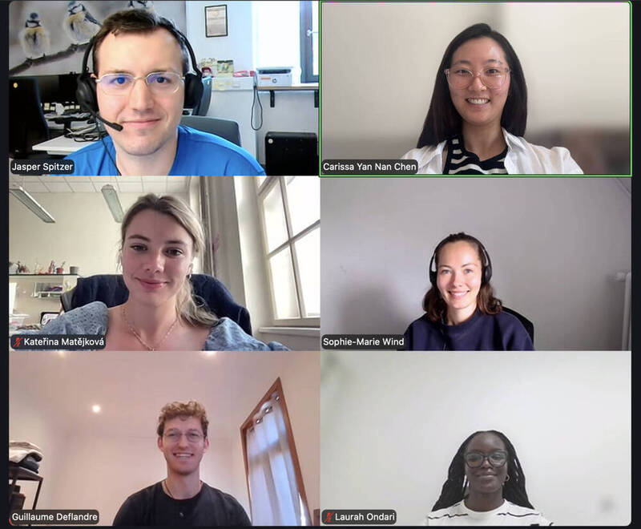
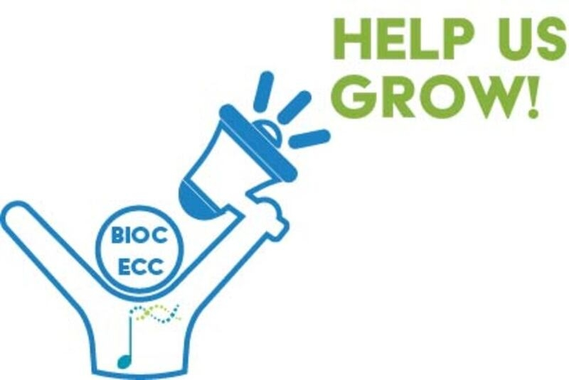

## Announcing the Bioconductor Student-ECR Council

From an idea that hatched during the EuroBioC2026 Birds of a Feather session, we are super excited to announce the formation of the [Student-ECR Council](https://workinggroups.bioconductor.org/currently-active-working-groups-committees.html#early-career-council)!

As a newly established Council, we aim to support **students and early-career researchers (ECRs)** in the Bioconductor community by providing a platform that brings together **developers and data scientists** through mentorship, networking, and professional development opportunities. 

## Meet the Council members

{fig-alt="Screenshot of participants at the first virtual Student-ECR Council meeting" fig-align="center"}

- Carissa Chen (Postdoctoral Researcher at University of Padova, Italy)

I am a computational biologist with a background in molecular biology and bioinformatics. My current research combines deep learning and statistical methods to jointly analyse sub-cellular spatial transcriptomics and histology images. I have been a long-time user of Bioconductor packages and I am now taking my first steps into computational method development. By joining the Student-ECR Council, I hope to support interdisciplinary researchers like myself to navigate the Bioconductor community. 

- Guillaume Deflandre (PhD student at UCLouvain in Brussels, Belgium)

I am a computational biologist with a background in bio-engineering. Initially out of touch with the biomedical field, I took a leap of faith during my Master’s thesis and absolutely loved it! Since then, I have been doing research on how to optimise peptidoform identification in single-cell proteomics. As soon as I delved into this world of bioinformatics, I was introduced to Bioconductor, its packages and its community. They have helped me so much so far, and by joining the Student-ECR council, I hope to help other researchers in the same way.

- Jasper Spitzer (Postdoctoral Researcher at the University of Bonn, Germany)

I am a computational biologist with a background in immunology. Throughout my PhD, I’ve focused increasingly on computational work and am now 100% on the computational side. Currently, I am working on large-scale CRISPR screen data as well as single-cell projects and am generally interested in how structure in data can be translated into biology. I’ve been a long-time user of Bioconductor packages and have recently tried to be a more active member of the community. With the positive experience I’ve had in the community, I want to share that fun and excitement by encouraging others to be a part of the community as well.

- Sophie-Marie Wind (PhD student at University of Münster, Germany)

I am a bioinformatician with a focus on high-throughput data analysis and method development. Currently, I am developing an analysis framework for 4C-seq data. My first contact with Bioconductor was during my master’s studies, when I used Bioconductor packages for data analyses. During my PhD, I became more involved in package development and came to appreciate the supportive and inspiring Bioconductor community. This experience motivated me to become more actively involved. As a member of the Student-ECR Council, I hope to share my enthusiasm for bioinformatics, contribute to the community, and help support other early-career researchers.

- Kateřina Matějková (PhD student at Charles University in Prague, Czech Republic)

I am a computational biologist with a background in molecular biology and genetics. My research focuses on splicing analysis in Mendelian diseases. I was first introduced to Bioconductor packages during my Master’s, and during my PhD, I joined EuroBioC. I deeply appreciate the supportive and collaborative nature of this community. Currently, we are working to establish a Czech BioC community and create educational initiatives to support early career researchers working at the intersection of biology and informatics.

## Our vision 

We aim to create an **inclusive and diverse environment** for students and early-career researchers in the Bioconductor community, from those **discovering Bioconductor for the first time to long-time users and developers** of Bioconductor packages.

Using this platform, our goal is to create opportunities for early-career researchers (ECRs) to connect with one another, cultivating a **positive and supportive** community that embraces **open science** and **reproducible research** practices. We also aim to empower researchers to **contribute** to Bioconductor projects, **strengthening transparency** and **encouraging community-driven software development**. At the same time, we hope to strengthen the **feedback loop between users and developers**, encouraging collaboration and helping shape and continuously improve the Bioconductor ecosystem.

A few of our proposed initiatives include:

- [Mentorship programme]{.underline} providing peer support alongside technical guidance on areas such as package development, coding best practices, and contributing to Bioconductor
- [Targeted seminars]{.underline} covering dissemination of the latest research and career panels
- [Workshops]{.underline} such as community-contributed package demonstrations
- ["Good First Issue" hackathons]{.underline} to help new contributors gain experience by working on beginner-friendly issues

...and more!

As we're just getting started, **we would also love to hear your ideas** for future events and initiatives! If you have any suggestions, please take a few minutes to fill in our [poll](https://forms.gle/KQfGcs3ALAPhCYws6).

To be notified about upcoming activities, please subscribe to our [Zulip channel](https://community-bioc.zulipchat.com/#narrow/channel/611088-student-ecr)!

## Bioconductor Mentorship Programme

We are launching the Bioconductor Mentorship Programme and are looking for both **mentees and mentors** for the upcoming intake (tentatively **October/November**). The proposed focus areas may include:

- [Package development]{.underline}: developing R scripts to a fully fledged Bioconductor package
- [Technical development]{.underline}: guidance on coding best practices, contributing to existing packages, and navigating the Bioconductor development community.
- [Peer mentoring]{.underline}: managing a PhD, career advice and more. Other areas TBC depending on interest, so please let us know if there are any specific areas you would benefit from!

If you are interested in participating in the Bioconductor Mentorship Programme, please express your interest [here](https://forms.gle/UetvHcEPfai5pMd78).

## Join us!

We welcome anyone from **all career stages and scientific backgrounds** to join the Council. Specifically, Council members are people who choose to take an active role, for example by attending meetings when they can and helping to plan or deliver activities according to their interests and availability.

Feel free to pop by our regular Council meetings on the [third Tuesday of every month at 9am CET](https://bioconductor.org/help/events/){.underline} to learn more. As we are welcoming new members who may be from different timezones, the meeting time is amenable to change so please don't hesitate to contact us.

If you are interested in joining the Student-ECR Council, please connect with us on our dedicated [Zulip channel](https://community-bioc.zulipchat.com/#narrow/channel/611088-student-ecr), or reach out to us via [email](student-ecr@bioconductor.org). 

Or just say hi and [introduce yourself on Zulip](https://community-bioc.zulipchat.com/#narrow/channel/611088-student-ecr/topic/Welcome.20and.20overview/with/604108019)! (We need more friends!)

{fig-alt="Stick man holding megaphone with text: 'Help us grow!'" fig-align="center"}

## BioC2026 in Seattle

We will be holding a live Q&A and casual Student-ECR gathering during [BioC2026 on Tuesday, August 11, from 8:30 to 9:00 am PT](https://bioc2026.bioconductor.org/schedule/). Members of the Council will join by Zoom to meet attendees and answer questions following their pre-recorded lightning talk on Monday. Come along to meet other ECRs in the Bioconductor community and learn more about how to get involved with the Student-ECR Council!
