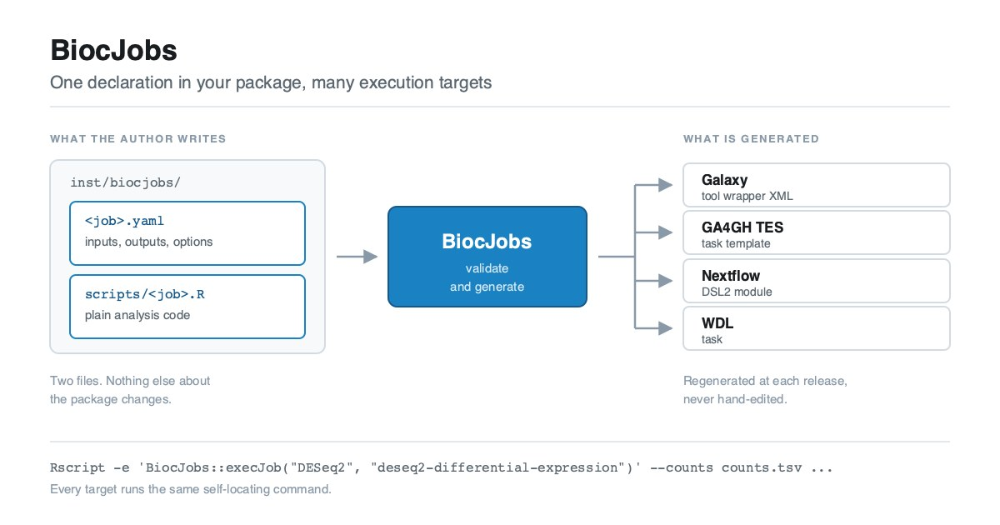

## The gap

Much of what Bioconductor packages do is interactive and exploratory, and
rightly belongs in an R session. But some of it is *batch-shaped*: a
well-defined analysis with file inputs, file outputs, and a handful of
parameters. Differential expression, normalisation, peak calling, amplicon
denoising, quantification import. None of these need a human in the loop
once the parameters are chosen, and this project targets that subset.

Yet every workflow system that wants to offer one of these analyses today
needs a **hand-written wrapper**: Galaxy, Nextflow, engines for CWL (Common
Workflow Language) and WDL (Workflow Description Language), cloud batch
services. Those wrappers are usually maintained by someone who is *not* the
package author, and they drift out of sync with the package at every
release. The community's hand-written Galaxy wrappers are excellent, but
each one took expert effort to build and takes expert effort to keep
current. The long tail of Bioconductor packages will never get that
treatment. An earlier post on this blog,
[Bringing Bioconductor to Galaxy](https://blog.bioconductor.org/posts/2025-07-03-bioc-to-galaxy/),
walks through what writing one of those wrappers by hand actually involves.

There is an ownership problem underneath the maintenance problem. The person
who knows which entry points make sense non-interactively, what the inputs
mean, and which parameters actually matter is the **package author**.

## Where this came from

This is not a new observation, and the framework described here is the
result of a long series of conversations rather than a single design
session.

Two of those conversations were decisive. At the **ELIXIR All Hands Meeting
in Lyon in early June 2026**, and again at the **Galaxy Community Conference
in Clermont-Ferrand later that month**, discussions between Bioconductor and
Galaxy people kept converging on the same idea from different directions.
There is real and growing appetite for automatically wrapping Bioconductor
tools for Galaxy, provided it can be done in a *high-quality,
developer-driven* way rather than as a lowest-common-denominator scrape of
function signatures. That qualifier is the whole design constraint. A
generated wrapper is only worth having if it is as good as a careful
hand-written one, and the way to get there is to have the package author
declare the interface deliberately, not have automation scrape it from functions.

The scope widened during those same discussions. Once an author has declared
a job precisely enough to generate a good Galaxy tool, that same declaration
should carry most of what a *general* workflow dispatcher needs. It seemed
wasteful to spend the effort and get only Galaxy out of it.

## Why the GA4GH task model became the goal

The design settled on the
[GA4GH Task Execution Service (TES)][tes] task model as the common
denominator.

TES is small. A task is: some input files staged in, a short sequence of
executors, each one a container image plus a command run one after another,
some resource requirements, and some output files collected out. That
sequence is the only structure TES has. No branching, no fan-out, no data
flow between tasks; orchestration is explicitly somebody else's job. That
minimalism is what makes it a good target for package developers. If a unit
of analysis can be expressed as a TES task, it can be projected onto a Galaxy
tool, a Nextflow process, a WDL task, or a cloud batch submission without
rewriting.

So BiocJobs declarations are shaped around that model, and Galaxy became one
target among several rather than the only one.

## What a job looks like

A package opts in by adding two files under `inst/biocjobs/`. Nothing else
about the package changes: no new imports, no code changes, no build-system
requirements. Packages that are inherently interactive simply do not add the
directory.

The first file is the **declaration**: what the job consumes, produces, and
exposes. Abridged here from the example DESeq2 spec, which declares two inputs,
three outputs and nine options:

``` yaml
biocjobs: "1.0"
name: deseq2-differential-expression
package: DESeq2
title: DESeq2 differential expression
description: >
  Runs the canonical DESeq2 workflow on a raw count matrix: size factor and
  dispersion estimation, negative-binomial GLM fitting and a Wald test for
  one pairwise contrast.
version: "1.0.0"
script: scripts/deseq2-differential-expression.R
depends: [apeglm, ashr]

inputs:
  - name: counts
    format: tsv
    label: Raw count matrix
    help: >
      Tab-separated matrix of raw (un-normalized) integer read counts.

outputs:
  - name: results
    format: tsv
    label: Differential expression results

options:
  - name: shrinkage
    type: choice
    choices: [apeglm, ashr, normal, none]
    default: apeglm
    label: Log2 fold change shrinkage
  - name: alpha
    type: float
    default: 0.1
    min: 0
    max: 1
    label: FDR threshold

resources:
  cpus: 1
  memory_gb: 4

citations:
  - doi: 10.1186/s13059-014-0550-8
```

The second file is the **script**: plain R, around 130 lines for DESeq2,
effectively the analysis script to dispatch. Its first line hands the entire
interface over to the declaration:

``` r
params <- BiocJobs::jobParams("DESeq2", "deseq2-differential-expression")
```

That call parses the command line *against the declaration*, applying type
coercion, defaults, numeric bounds, enumerated choices, required-parameter
checks and output directory creation. What is notably absent from the script
is any argument parsing, any type checking, and any usage message, handled by
the BiocJobs framework. The rest of the file is ordinary analysis code reading
`params$counts`, `params$alpha` and so on.

## What comes out

{fig-alt="Diagram showing two files written by the package author, a job YAML declaration and an R analysis script under inst/biocjobs/, passing through BiocJobs, which validates them and generates four artifacts: a Galaxy tool wrapper XML, a GA4GH TES task template, a Nextflow DSL2 module and a WDL task." fig-align="center"}

From that one declaration, BiocJobs generates:

| Target | Artifact |
| --- | --- |
| Galaxy | tool wrapper XML, with typed params, datatypes, tests and citations |
| GA4GH TES | a v1.1 task template, ready to `POST` to a TES server such as Funnel or TESK, or to a cloud endpoint |
| Nextflow | a Nextflow DSL2 module with typed inputs, named `emit:` outputs and a stub block |
| WDL | a 1.0 task with `runtime` and `parameter_meta` |

: Artifacts generated from a single BiocJobs declaration {tbl-colwidths="[22,78]"}

Every target launches the same self-locating command, so the artifacts carry
no absolute paths and do not drift against the installed package:

``` bash
Rscript -e 'BiocJobs::execJob("DESeq2", "deseq2-differential-expression")' \
    --counts counts.tsv --coldata coldata.tsv \
    --contrast_factor condition --contrast_numerator treated \
    --contrast_denominator control --alpha 0.05
```

## First implementation, at the BioC2026 hackathon

The first working implementation was built at the [BioC2026 hackathon in
Seattle](https://github.com/BiocCodingCollaborations/BiocNA2026_Hackathon) in August 2026, spearheaded by Alexandru Mahmoud, and taken far
enough to get a first working example.

**DESeq2** was chosen for this purpose. It is a popular package, batch-shaped,
and is already used in many workflow engines, hence having something to compare
against after generating the wrappers.
A [fork of DESeq2][deseq2fork] carries the two `inst/biocjobs/` files a
maintainer would add.

The job itself was run end to end in R against simulated data, 600 genes by
6 samples with 60 planted differentially expressed genes, recovering the
planted signal; the same run through the generated command-line path
produced byte-identical results. The generated artifacts were then checked
with the tooling each ecosystem uses. The Nextflow module passes
`nextflow lint` with zero findings and executes under `-stub-run` with
correct channel and `emit:` wiring. The WDL task passes `miniwdl check`. The
Galaxy wrapper validates against Galaxy's official tool XML schema (XSD),
and the TES task against the GA4GH TES 1.1 `tesTask` schema.

What none of that establishes is whether a generated artifact survives a
real workflow run against real data, which is where the next section comes
in.

## Independent evaluations

The most useful outcome from the Hackathon collaboration was an evaluation
by Nextflow and WDL users. The WDL evaluation was documented in the
[WILDS WDL Library][wilds] which added a `run_deseq2_biocjobs` task to the
`ww-deseq2` module, calling `BiocJobs::execJob()` as an alternative to the
module's existing hand-written R script, and ran it against real data. It
produced valid results tables, normalised counts and plots.

The PR was closed rather than merged, with more testing to come in the future.

Feedback, in the form of GitHub issues, was provided regarding the formatting
of the Nextflow module files generated by BiocJobs. Topics to consider include:

* The extent to which we should strive for compatibility with nf-core
* Separate input items vs inputs grouped into tuples, with the latter being
useful in multi-sample processing
* Use of the `tag` directive
* Naming of output files

As a test from the Bioconductor package developer perspective, an example
job was successfully developed for the VariantAnnotation package. The job
takes as inputs an indexed VCF, a BED indicating regions of interest, and a
list of sample names, and produces a TSV of genotypes reformatted as
alternative allele counts.

## A subproject: per-package containers

Making a job dispatchable exposes a second problem immediately. A generated
wrapper needs an environment containing R, the host package, and the job's
declared dependencies, and the generic Bioconductor container ships none of
the analysis packages.

That pushed out a parallel subproject: a pipeline to **automatically build
and host a container per Bioconductor package**, or per group of packages,
or per BiocJobs script. Each image would carry one package plus everything
it declares (`Depends`, `Imports`, `LinkingTo` and `Suggests`) so that
vignettes, examples and the package's own tests all run inside it.

This is not a replacement for the container infrastructure Bioconductor and
BioContainers already provide; it builds directly on top of it. Images are
layered on the existing Bioconductor base stacks, both the familiar
[`bioconductor_docker`](https://bioconductor.org/help/docker/) images and the
newer `bioc2u` stack, which installs packages as Debian binaries and so builds
far faster. The distinction from what exists today is granularity. Bioconductor
publishes broad base images, and
[BioContainers](https://biocontainers.pro/) publishes per-package images built
from the Bioconda recipes; what a dispatched job wants is an image scoped to
exactly one package and its full declared dependency closure, tracking the
Bioconductor release directly. Longer term, the ambition is to work with
BioContainers so that these images are published in their Quay repository
alongside the Bioconda-derived ones, since that is where workflow authors
already look. Per-package images on GHCR are simply the first target, because
they can be built and iterated on without coordination.

The one image that exists so far, `ghcr.io/almahmoud/deseq2:devel`, was built
ad hoc from the DESeq2 fork, and is what the WDL evaluation described above
actually ran against. The work in progress for building all packages lives at
[almahmoud/biocpkgcontainers](https://github.com/almahmoud/biocpkgcontainers).

## How this was built

The design of the specification, meaning what a job declaration contains and
what the runtime contract is, came out of the conversations described above
and out of a much wider set of them over a longer period.

In the interest of transparency: the first implementation of the generators,
and a first draft of this post, were written with substantial assistance
from Claude, in order to get something runnable in front of others quickly.
The result is a functioning prototype rather than a finished product, and it
still needs a great deal of refinement by human hands.

## This is early, and here is what would help if you want to contribute

BiocJobs is a **work in progress**. The spec is marked version 1.0 but should not
be considered stable and should still be expected to change before an actual v1
release. Today it supports single-file inputs only, five option types, and one
analysis command per job. Collections, multi-file inputs and a CWL generator are
on the roadmap. Nothing here is set in stone, and that is deliberate, so any and
all feedback is welcomed.

Two groups of people could help enormously right now.

**Bioconductor package developers.** The single most valuable contribution
is adding a job declaration to your own package. The framework has been
validated on exactly one package so far, which is not enough to know whether
the specification is expressive enough, whether the format vocabulary covers
real use cases, or whether the runtime contract survives contact with
analyses structured differently from DESeq2. Every additional package is a
test of the design. If a job in your package cannot be expressed in the
current spec, that is precisely the feedback needed before a first release.

**Workflow developers.** If you maintain Galaxy tools, Nextflow modules, WDL
tasks or [nf-core](https://nf-co.re/) pipelines, generated wrappers need to
hold up against the standards you already apply by hand. The WILDS evaluation
above is a great model: take a generated artifact, try to use it in a real
pipeline, and say plainly where it falls short.

Before a first version is stabilised, the aim is to have job declarations in
ten or so packages of different shapes, with the generated artifacts reviewed
manually to validate their correctness. If that describes you or your package,
open an issue on the [BiocJobs repository][biocjobs] and say which package you
have in mind!

There is also a good opportunity to work on this together in person or
remotely. BiocJobs is one of the projects at the
[**BioFAIR 2026 Workflow Interoperability Sprint**][sprint], a hybrid event
running **15 to 17 September 2026** in Milton Keynes, United Kingdom, which
brings together developers from across the Bioconductor, Galaxy, Nextflow,
nf-core and WDL ecosystems. If you would like to join, in person or remotely,
the sprint repository has the details, and the
`#biofair2026-workflow-sprint` channel on
[Bioconductor Zulip](https://chat.bioconductor.org/) is where planning happens.

## Links

- **[BiocJobs on GitHub][biocjobs]**, the first implementation, and where to
  leave feedback as issues
- **[The DESeq2 fork][deseq2fork]**, used to validate the framework on a
  first example
- **[The WILDS WDL Library evaluation][wilds]** of the generated WDL

## Acknowledgements

The design of this framework came out of a large collaborative network and a
great many conversations among researchers worldwide, particularly across
the **Bioconductor**, **Galaxy** and **OpenWDL** communities. It would not
exist without the people who kept raising these ideas.

[tes]: https://github.com/ga4gh/task-execution-schemas
[biocjobs]: https://github.com/almahmoud/BiocJobs
[deseq2fork]: https://github.com/almahmoud/DESeq2
[wilds]: https://github.com/getwilds/wilds-wdl-library/pull/392
[sprint]: https://github.com/BiocCodingCollaborations/BioFAIR2026_Sprint
[biocexecute]: https://github.com/BiocCodingCollaborations/BiocExecute
