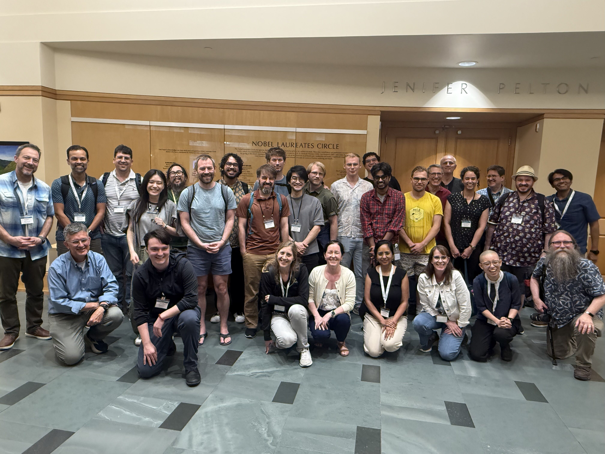{.zoomable width="100%"}

The North American Bioconductor Conference 2026 ([BioC2026](https://bioc2026.bioconductor.org/)) took place from August 10-12, 2026, at the Fred Hutchinson Cancer Center in Seattle, Washington. The conference brought together researchers, developers, educators, and community members to explore current developments within and beyond the Bioconductor project.
BioC2026 welcomed 108 attendees, with 70 participating in person and 38 joining virtually. Across the three days, the programme featured three keynote speakers, 20 contributed speakers, and 17 sessions. The programme highlighted the breadth of biological research supported by Bioconductor, as well as the tools, infrastructure, and communities that enable open and reproducible computational biology.
The conference was then followed by two community events on August 13-14: a Carpentries workshop on orchestrating large-scale single-cell analysis with Bioconductor and the Bioconductor North America 2026 Hackathon.

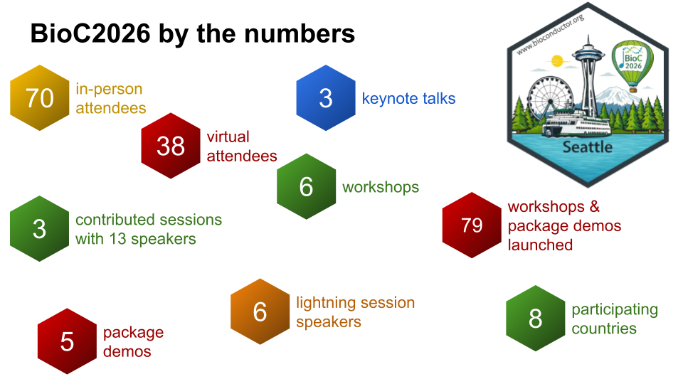{.zoomable width="100%"}

## Participants by country
Participants travelled to Seattle from across North America and beyond, reflecting the international reach of the Bioconductor community. Attendees joined from the United States, Canada, Germany, Ireland, the United Kingdom, Australia, and Nigeria.
The audience included researchers at different stages of their careers, with staff representing 42% of attendees, followed by students and postdoctoral researchers at 28%, faculty at 13.8%, industry at 13.8%, and government at 2.4%.

## Programme overview

### Keynotes
The conference featured three keynote speakers: 

- [Jeff Leek speaking on "Building Open Infrastructure for Translational AI in a Cancer Center"](https://www.youtube.com/watch?v=FuFSePQXVhM&t=187s)  
- [Ting Ye speaking on "From Association to Causation: Genetic-Anchored Causal Inference in Human Biology"](https://www.youtube.com/watch?v=ZG0weEXGvlA&t=21s)  
- [Michael Lawrence speaking on "S7 for Bioconductor"](https://www.youtube.com/watch?v=_-sitxM0pNM)   

::: {#gallery-keynote .columns}
::: {.column width="33%"}
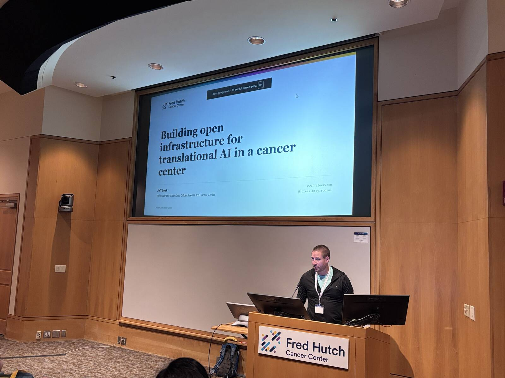{group="gallery-keynote" style="padding-right: 1px;" alt="Jeff Leek giving his keynote at BioC2026"}
:::

::: {.column width="33%"}
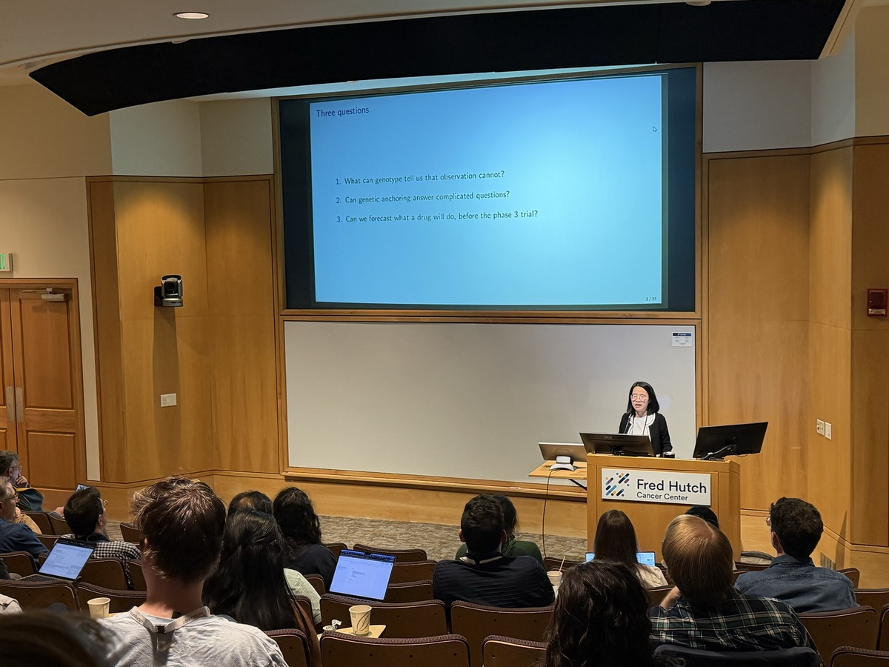{group="gallery-keynote" style="padding-right: 1px;" alt="Ting Ye giving her keynote at BioC2026"}
:::

::: {.column width="33%"}
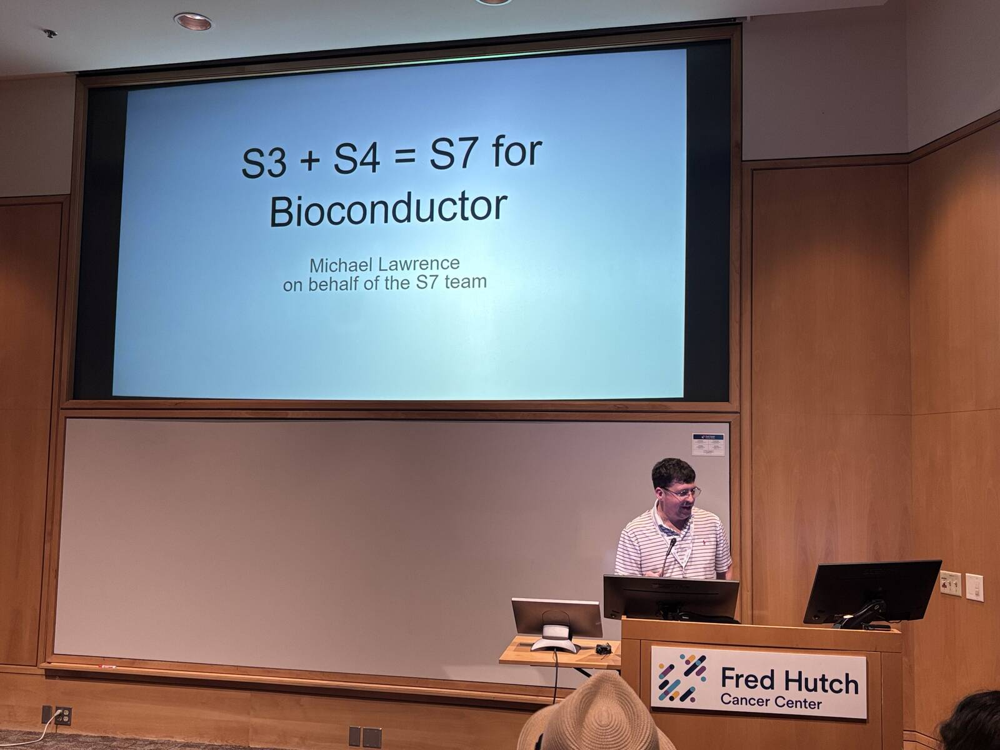{group="gallery-keynote" style="padding-right: 1px;" alt="Michael Lawrence giving his keynote at BioC2026"}
:::
:::

::: {style="text-align: center;"}
*Left to Right: Jeff Leek, Ting Ye and Michael Lawrence giving their keynotes at BioC2026*
:::

### Short talks
Twenty contributed speakers shared their work across the conference programme. The short talks at BioC2026 reflected the breadth of research and development across the Bioconductor community. Topics ranged from community training and developer engagement to multi-omics exploration, reproducible workflows, and AI infrastructure. The programme also covered emerging areas of biological data analysis, including spatial transcriptomics, antibody repertoire analysis, rare variant testing, DNA methylation, structural variation, and Perturb-seq. 

### Poster sessions and package demo sessions
The poster session showcased a diverse range of research applications and software development projects from across the Bioconductor community. Topics included single-cell and spatial transcriptomics, multi-omics integration, microbiome analysis, proteomics, antibody repertoire analysis, functional enrichment, ancestry inference, genomic data processing, and AI-guided drug discovery.
The posters provided an opportunity for attendees to discuss new methods and tools in a more informal setting, while connecting researchers, package developers, and community members working across different areas of computational biology. The sessions also complemented the package demonstrations, creating space for participants to explore new software and engage directly with the people developing and applying Bioconductor tools.

Feedback from the conference showed that these interactions were particularly valuable, with attendees highlighting conversations around posters and package demonstrations as some of the most useful networking opportunities.

  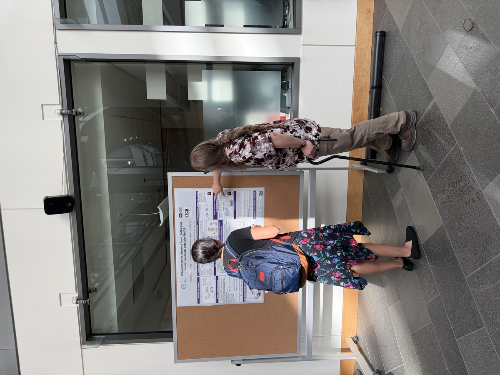{.zoomable width="100%"}

*Participants during the poster session.*

### Celebrating 25 years of Bioconductor
The celebrations marking Bioconductor’s 25th anniversary continued at BioC2026 following the celebrations that began at EuroBioC2026 earlier in the year. The milestone was marked with a specially branded anniversary cake, thanking participants and community members for being part of the Bioconductor community and contributing to its growth over the past 25 years. 

::: {#gallery-25 .columns}
::: {.column width="50%"}
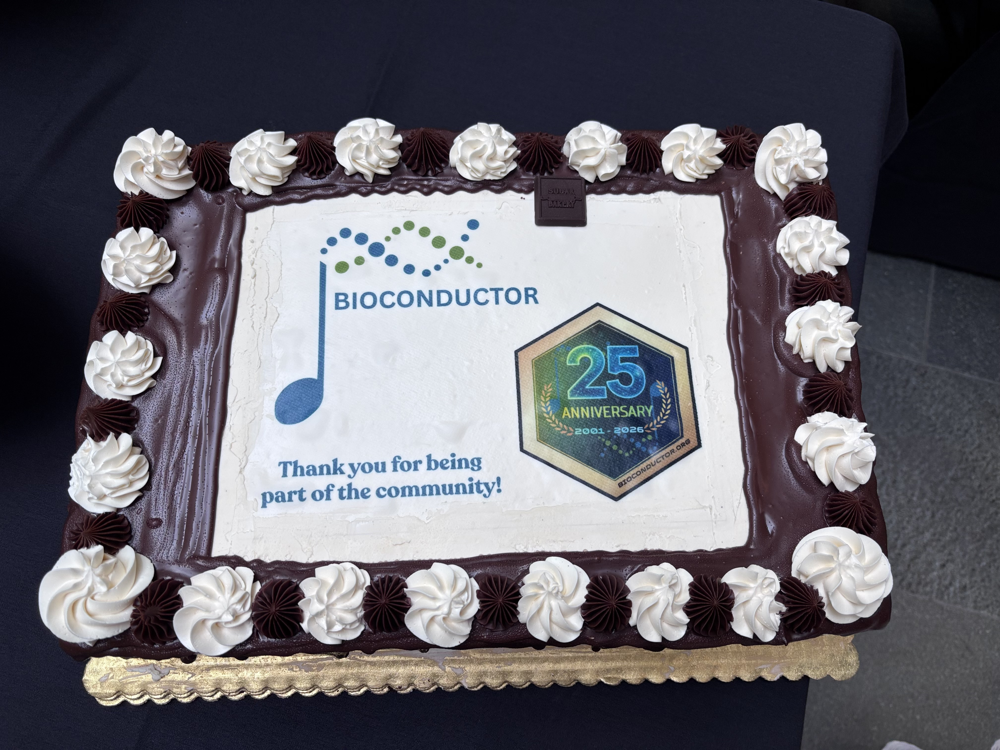{group="gallery-25" style="padding-right: 1px;" alt="Cake with Bioconductor 25th anniversary logo and text 'Thank you for being part of the community!'"}
:::

::: {.column width="50%"}
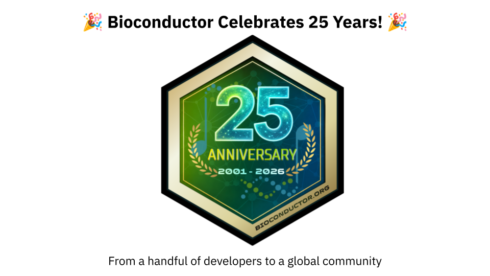{group="gallery-25" style="padding-right: 1px;" alt="Image with text 'Bioconductor celebrates 25 years!', 25th anniversary logo, and text 'From a handful of developers to a global community!'"}
:::
:::

::: {style="text-align: center;"}
*Bioconductor at 25 celebrations.*
:::

## Community and networking

One of the strongest themes to emerge from the BioC2026 survey was the value of the Bioconductor community itself. Participants described the conference as welcoming, collaborative, and interactive, and appreciated the opportunity to reconnect with colleagues and meet new people. All respondents who answered the question said they would recommend BioC2026 to their colleagues.
The smaller size of the conference was also seen as a strength. Several respondents noted that the more intimate format made it easier to engage in conversations and build connections across different roles and career stages.
Networking was consistently identified as one of the most valuable aspects of the event. Participants appreciated both the formal scientific programme and the informal conversations that happened around talks, posters, and demonstrations. Looking ahead, many attendees expressed interest in even more dedicated time for networking and informal interaction.

## Infrastructure and tools

### Zulip

During BioC2026, Zulip provided a dedicated space for participants to connect, interact and stay engaged throughout the conference. The conference space included topic-based discussions covering: 

- **Workshops**: Dedicated topics for individual workshops, including Single Cell, Bioconductor in Workflows, microbiome, WebR, and other training sessions.  
- **Training & education**: A space for broader conversations around training activities and educational sessions.  
- **Social**: Topics for informal conversations, social activities and connecting with other participants.  
- **Introductions**: Participants could introduce themselves and connect with others attending the conference.  
- **Conference logistics channels**: For travel, rooms, schedules, Day 1 information, and general conference support.  
- **Community engagement**: Dedicated spaces for the developer survey, student and early-career researcher activities, and other community initiatives.  
- **Help and support**: Dedicated topics such as the helpdesk, lost and found, and issues accessing virtual sessions.  

### Sticker contest winner

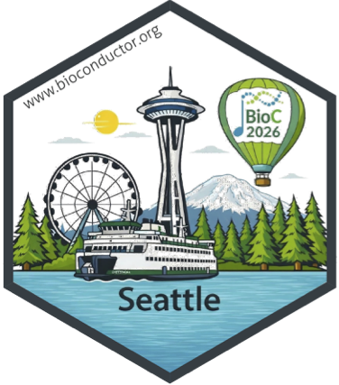

Kayva Vaddadi was BioC2026's sticker design contest winner. Kayva's design
celebrated Seattle as the host city of BioC2026, featuring well-known landmarks
such as the Space Needle, the Seattle Great Wheel, Mount Rainier, and the
surrounding evergreen forests. Puget Sound and a Washington State ferry reflect
Seattle's maritime landscape and the culture of connection across the region.
The BioC2026 hot air balloon on the sticker was inspired by the scenic balloon
views popular in the Seattle area and represents the celebratory and exploratory
spirit of the Bioconductor community.

See the announcement here:
<a href="https://lnkd.in/p/emAWMGX">https://lnkd.in/p/emAWMGX</a>

## Conference materials

All conference recordings are available on the [Bioconductor YouTube channel](https://www.youtube.com/watch?v=OzpgIa2W414&list=PLMYePXTcNLQo). BioC2026 workshops will also be available in the “Archived” section of [workshop.bioconductor.org](http://workshop.bioconductor.org), alongside workshops from previous BioC, EuroBioC, and BiocAsia events. If you’d like to add additional materials or use the platform for your own workshop or course, contact us at [support.bioconductor.org](http://support.bioconductor.org).

## Post-conference events
### Orchestrating Large-Scale Single-Cell Analysis with Bioconductor

On August 13–14, participants took part in a Carpentries workshop focused on orchestrating large-scale single-cell analysis with Bioconductor led by Ted Laderas and Wes Wilson.
The workshop was attended by 11 participants and provided a hands-on environment for participants to work through approaches for analysing large-scale single-cell datasets using Bioconductor tools and workflows. Feedback highlighted the value of the live coding, small-group format and complementary teaching approaches.

::: {#gallery-carp .columns}
::: {.column width="50%"}
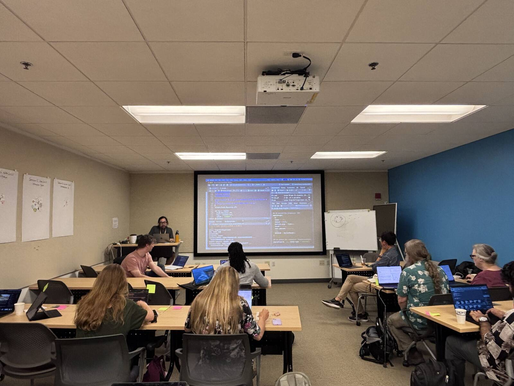{group="gallery-carp" style="padding-right: 1px;" alt="Ted Laderas teaching at the Carpentries workshop"}
:::

::: {.column width="50%"}
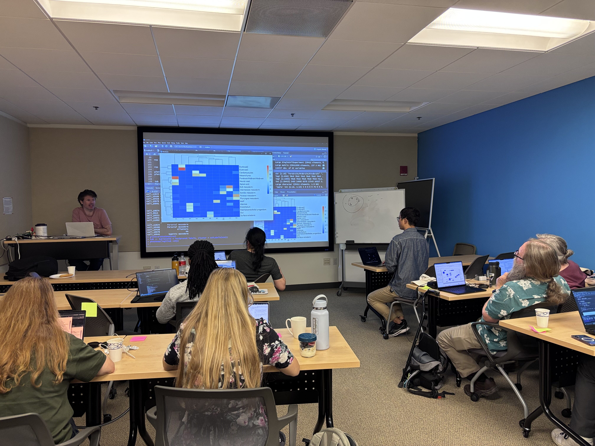{group="gallery-carp" style="padding-right: 1px;" alt="Wes Wilson teaching at the Carpentries workshop"}
:::
:::

::: {style="text-align: center;"}
*Bioconductor Carpentry instructors, Ted and Wes, and participants during the scRNA-seq workshop.*
:::

### Bioconductor North America 2026 Hackathon

The Bioconductor North America 2026 Hackathon took place on August 13–14, bringing community members together to collaborate on software and infrastructure projects that strengthen interoperability, software development, and the wider Bioconductor ecosystem. 
These projects included:  

- AI harness tools for standardizing how users within organizations would interact with agents on shared projects and on shared institutional resources. Link: [https://github.com/eisenefaust/harness_agent](https://github.com/eisenefaust/harness_agent)

- Bioconductor tooling for including CLI executable components in Bioconductor packages. Link: [https://blog.bioconductor.org/posts/2026-08-21-biocjobs/](https://blog.bioconductor.org/posts/2026-08-21-biocjobs/)

- An exploration on benchmarking LLM generated workflows, building out infrastructure and paradigms for how we can evaluate what LLMs return as work product to scientific questions. Link: [https://github.com/Amisor/LLM_BioBenchmarking/tree/main](https://github.com/Amisor/LLM_BioBenchmarking/tree/main)

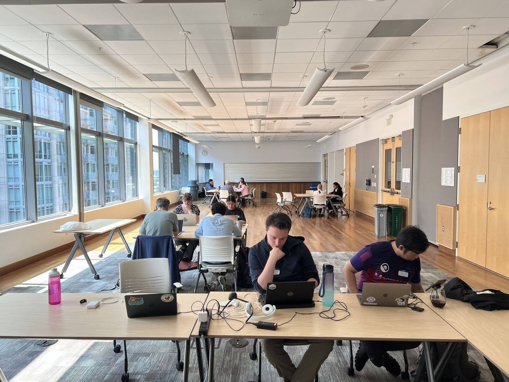{.zoomable width="100%"}

*Participants during the Hackathon.*

## Up next...
Later this year, the Bioconductor community will head to Melbourne, Australia, for BioCAsia2026, taking place on November 19-20, 2026. [BioCAsia2026](https://biocasia2026.bioconductor.org/) brings together researchers, developers, and data scientists from across the Asia-Pacific region and beyond to share advances in bioinformatics, computational biology, and open-source software. The meeting will highlight practical training, community building, and the latest developments in R and Bioconductor.
BioC2027 will then take place in early summer in Boston, Massachusetts, continuing the North American Bioconductor conference series and bringing the community together once again for scientific exchange, collaboration, and community building.
The community will thereafter gather in Basel, Switzerland, for EuroBioC2027, taking place from September 8–10, 2027. The European Bioconductor Conference will continue to bring together researchers, developers, and educators from across Europe and beyond to share new software, methods, and applications in computational biology.

## Acknowledgements
BioC2026 gratefully acknowledges the support of all sponsors and partners whose contributions and support made the conference possible.

### Sponsors
BioC2026 was proudly supported by [Cortex](https://cortexbiolabs.com/), [R Consortium](https://r-consortium.org/) and [Posit](https://posit.co/).

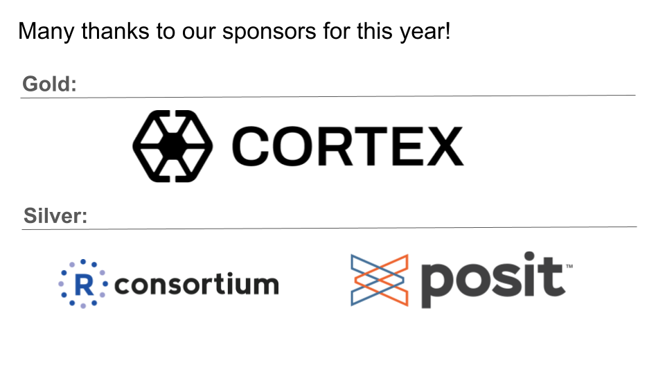{.zoomable width="100%"}

### Organising committee
We thank the local organisers, programme committee, workshop instructors, keynote speakers, volunteers, sponsors, and all participants whose contributions made BioC2026 a success.

- Marc Carlson, Seattle Children's Hospital
- Nicholas Cooley, University of Limerick
- Sean Davis, University of Colorado Cancer Center
- Maria Doyle, University of Limerick
- Mikhail Dozmorov, Virginia Commonwealth University
- Jenny Drnevich, University of Illinois at Urbana-Champaign
- Russell Eberts, Fred Hutchinson Cancer Center
- Erica Feick, Dana-Farber Cancer Institute
- Sana Hirata, Fred Hutchinson Cancer Center
- Ted Laderas, Fred Hutchinson Cancer Center
- Alexandru Mahmoud, University of Limerick
- Matthew McCall, University of Rochester Medical Center
- Lori (Shepherd) Kern, Roswell Park Comprehensive Cancer Center
- Laurah Nyasita Ondari, International Institute of Tropical Agriculture (IITA)
- Charlotte Soneson, Friedrich Miescher Institute for Biomedical Research
- Tim Triche, Van Andel Institute
- Levi Waldron, CUNY Graduate School of Public Health and Health Policy
- Wes Wilson, Princess Margaret Cancer Centre
