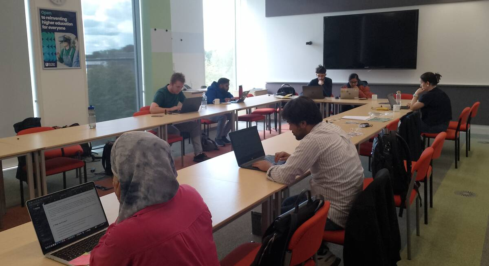
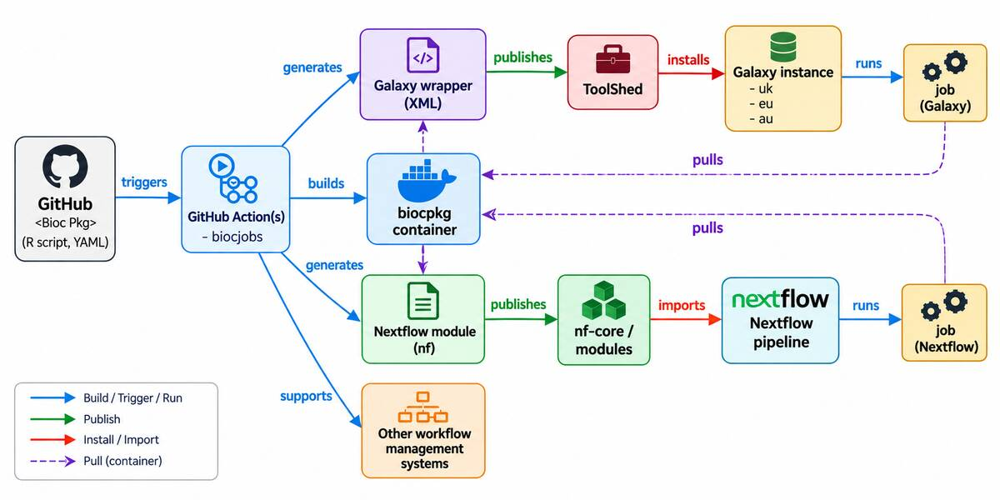

On 15-17 September 2026, members of the [Bioconductor][bioconductor], [Galaxy][galaxy] and [nf-core][nf-core] communities came together at [The Open University][the_open_university] in Milton Keynes for the [BioFAIR Data to Discovery][biofair_data_to_discovery] and [BioFAIR Collaboration Fest (CoFest)][biofair_collaboration_fest_cofest] joint event.

The three-day event combined hands-on training with collaborative work on research software interoperability.
It was jointly organised by [BioFAIR Fellow][biofair_fellows] [Marisa Loach][marisa_loach_orcid] and [BioFAIR Pathfinder][biofair_pathfinder_project] project lead and [Institute for Research Software 2026 Fellow][kevin_rue_fellowship] [Kevin Rue-Albrecht][kevin_rue-albrecht_orcid].

The CoFest brought together contributors based in the UK, Ireland, Germany, India and the USA, with both in-person and remote participation.

Marisa led the **Data to Discovery** training, introducing participants to single-cell analysis using the European instance of the Galaxy platform (<https://usegalaxy.eu/>), while Kevin led the hybrid **CoFest** focused on making methods developed as Bioconductor R packages more readily accessible through infrastructures such as Galaxy and nf-core.

## The challenge: making methods reusable across ecosystems

There are numerous communities in the bioinformatics space focusing on different aspects like code development, making non-code GUIs, creating tutorials and documentation, and more.
Some of these are Bioconductor, Galaxy and nf-core, which play complementary roles in bioinformatics.
**Bioconductor** provides a large ecosystem of R packages implementing analysis methods; **Galaxy** provides an accessible environment for running and sharing reproducible analyses; and **nf-core** provides a community framework for portable [Nextflow][nextflow] pipelines.

The challenge is that making the same method available across these environments often requires separate wrappers, metadata and maintenance.
The **BioFAIR Pathfinder** project behind the event is exploring ways to reduce that duplication, including tooling for adapting Bioconductor methods as Galaxy tools and nf-core modules.

A major focus of the CoFest was [BiocJobs][biocjobs], an approach being developed that allows analysis tasks to be described alongside Bioconductor packages and used to generate representations for different workflow systems.

## Putting the idea into practice

Rather than only *discussing* interoperability, participants *applied* this approach to an [exemplar single-cell analysis workflow][exemplar_single-cell_analysis_workflow].

The group mapped parts of that workflow to reusable package-level ‘BiocJobs’ and tested the path from descriptions maintained alongside Bioconductor packages to generated workflow components.
Work covered steps including data import, quality control, normalisation, dimensionality reduction and marker analysis.

This gave contributors a concrete way to test the process, improve documentation, and identify what would be needed to make it easier for others to contribute.

{fig-alt="Photo of participants working during the CoFest." fig-align="center"}

On the final day, we captured the workflow we had been working towards in a single diagram: from a commit to a Bioconductor package repository, through the automatic building and publishing of tool wrappers, to their use in Galaxy, nf-core and other workflow environments.

{fig-alt="Workflow diagram illustrating the contribution process and automated building and dissemination of Bioconductor tool wrappers across other software ecosystems." fig-align="center"}

Three days were not enough to fully implement the workflow captured in the diagram - nor was that the goal.
Instead, the CoFest demonstrated the process on a small number of selected workflow steps, while documenting how others could contribute.
This created a foundation for onboarding new contributors and, over time, enabling more contributors to create wrappers for other widely used Bioconductor methods.

## What we learned

One of the clearest lessons was that interoperability is not just about writing software that connects one platform to another.

It also depends on deciding where information should live, who is best placed to maintain it, and how contributions can fit naturally into the practices of each community.
Bringing Bioconductor package developers, Galaxy contributors, and nf-core developers into the same room made it possible to look at the process end to end rather than from the perspective of a single ecosystem.

The event also reinforced the value of working from a concrete scientific use case.
Using a real single-cell workflow gave participants something shared to build, test and discuss, while exposing questions that would have been difficult to anticipate from design discussions alone.
The [CoFest notes][cofest_notes] capture several of those emerging questions, particularly around how reusable jobs should be structured and composed.

## What comes next

The CoFest was intended as a starting point rather than a one-off sprint.

The immediate next step is to continue refining the workflow demonstrated during the event: improving the tooling and documentation, testing it on additional Bioconductor methods, and making it easier for new contributors to take part.

We are also planning follow-up events in the first quarter of 2027. These will provide an opportunity to bring the communities together again, build on the examples developed in Milton Keynes and involve more contributors in extending the approach to other widely used methods.

The longer-term aim is simple: make it easier for software developed in one research community to become useful, sustainable building blocks in another.

Interested in getting involved? [Join the Bioconductor Zulip and the #biofair2026-workflow-sprint channel](https://community-bioc.zulipchat.com/join/zsfbiqh64t3nq5ldrmv72b4w/) and follow the BiocJobs topic for ongoing discussion.

[bioconductor]: https://www.bioconductor.org/
[galaxy]: https://galaxyproject.org/
[nf-core]: https://nf-co.re/
[the_open_university]: https://www.open.ac.uk/
[biofair_data_to_discovery]: https://training.galaxyproject.org/training-material/events/2026-07-06-biofair.html
[biofair_collaboration_fest_cofest]: https://github.com/BiocCodingCollaborations/BioFAIR2026_Sprint
[biofair_fellows]: https://biofair.uk/fellows/
[marisa_loach_orcid]: https://orcid.org/0000-0001-6979-6930
[biofair_pathfinder_project]: https://www.software.ac.uk/news/ssi-fellow-awarded-biofair-pathfinder-project
[kevin_rue_fellowship]: https://www.software.ac.uk/fellowship-programme/kevin-rue-albrecht
[kevin_rue-albrecht_orcid]: https://orcid.org/0000-0003-3899-3872
[nextflow]: https://www.nextflow.io/
[biocjobs]: https://blog.bioconductor.org/posts/2026-08-21-biocjobs/
[exemplar_single-cell_analysis_workflow]: https://kevinrue.github.io/biofair-pathfinder-2026/tutorial-singlecell-bioconductor/
[cofest_notes]: https://docs.google.com/document/d/1eKNACIPJf6vLIzBrE-8yrtCrYcmiXGMzYhBouuoVxR0/edit?usp=sharing
